# 2015年

## 12月

---

> 2015-12-27 18:54:46

看得远，才自卑

> 评论(0)：

---

> 2015-12-24 13:04:28

You say that you love rain,

but you open your umbrella when it rains...

You say that you love the sun,

but you find a shadow spot when the sun shines...

You say that you love the wind,

but you close your windows when wind blows...

This is why I am afraid;

You say that you love me too...

> 评论(0)：

---

> 2015-12-22 21:11:22

我是解题专业户

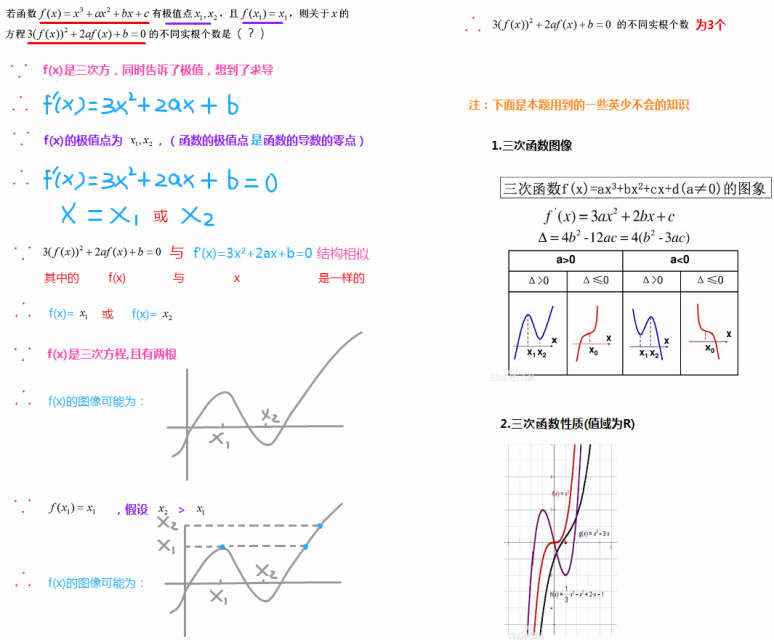
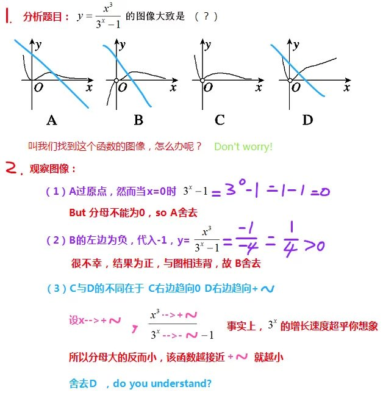

> 评论(0)：

---

> 2015-12-21 13:39:10

学校最大的不好之处是给了你一个混日子的借口：看，我在学校呢！

> 评论(0)：

---

> 2015-12-16 00:37:18

你要的快乐，就在生活与愿望的平衡点 ：

生活=工作+家庭+…

愿望=爱好+梦想+…

调理好，你就是个幸福的人

有些人的工作就是他们的爱好，所以他们除了家庭不需要调理太多，只是投入工作

而那是可遇不可求的，运气

作为一个平凡人，你要相信，平凡人的快乐，基本就建立在工作、家庭、爱好这三点中，连成条线，就是人生。

> 评论(0)：

---

> 2015-12-12 20:28:08

努力工作、懂得休息、少说废话

> 评论(0)：

---

> 2015-12-07 08:13:15

Goodbye my love,

it's time to go home,

don't worry me,

I'll be safety.

> 评论(1)：

*  [王希](https://user.qzone.qq.com/1483923283)：骚年飞

## 11月

---

> 2015-11-29 15:36:16

现在我才知道，考试是把一个人从一群人中区分出来的最好方法。

> 评论(1)：

*  [不要过来啊～](https://user.qzone.qq.com/1713106357)：的

---

> 2015-11-27 16:30:25

放轻松，不着急，着急也没有用

> 评论(0)：

---

> 2015-11-13 21:39:28

问我人生是什么？我想我懂了。

那就是跟随你的需求，追求你的梦想。

> 评论(0)：

---

> 2015-11-02 17:40:04

永远不要忘了自己要做什么，人生太短，只生存这个目标未免太低。

> 评论(0)：

## 10月

---

> 2015-10-30 22:35:08

你把新概念二册和三册

句意、词义、语法彻底理解并记忆(背诵或者脱口而出，不看书那种)

你就会觉得高中英语、大学英语、46级什么的都弱爆了

> 评论(4)：

*  [在白天走路](https://user.qzone.qq.com/2431350477)：24hmz 备注z~y
*  [在白天走路](https://user.qzone.qq.com/2431350477)：24hmz 备注z~y
*  [在白天走路](https://user.qzone.qq.com/2431350477)：24hmz 备注z~y
*  [在白天走路](https://user.qzone.qq.com/2431350477)：24hmz 备注z~y

---

> 2015-10-19 19:40:03

不是由能力得到的分数，我不要。

没能力就没能力，我不装。

> 评论(0)：

---

> 2015-10-17 20:41:07

为什么看UC新闻会厌世呢？

> 评论(1)：

*  [们](https://user.qzone.qq.com/1396652740)：那就别看，就一份安然宁静淡漠的心。你想了太多，虽然我说得很容易，自己也做不到，当你很安静你也许会明白一点

---

> 2015-10-17 20:20:08

正面事实是一种精神折磨。——我常被折磨

> 评论(0)：

---

> 2015-10-14 21:36:49

只想证明我活着。

> 评论(1)：

*  [Gabe](https://user.qzone.qq.com/2317344338)：好久不贱。

---

> 2015-10-08 15:39:23

《科举考试，磨人十年》

本修十年，即成天才。

于校中庸，耗你气元。

悔己当初，举步维艰。

期年之后，布衣一员。

> 评论(1)：

*  [们](https://user.qzone.qq.com/1396652740)：夫娥赴火，觊觎光热，弗得而飞灰。至死所求 ，其得者何？朝暮一生，不逐繁花，不恋余暇，所求者，至其于死地。奈何本性使然，则以何怨？    拙笔浅议，能解否？若解，又以何怨？

---

> 2015-10-08 12:21:40【转发】

how difficult!

> 原文:

[Apple-苹果专卖店](https://user.qzone.qq.com/244384)：为什么把我生在湖南

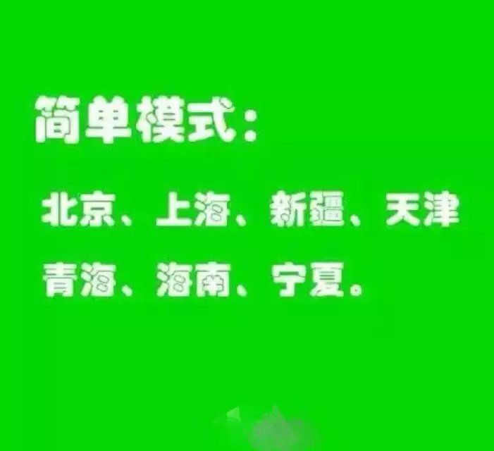
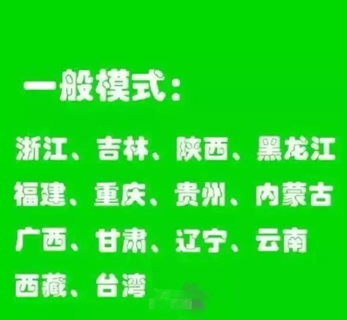

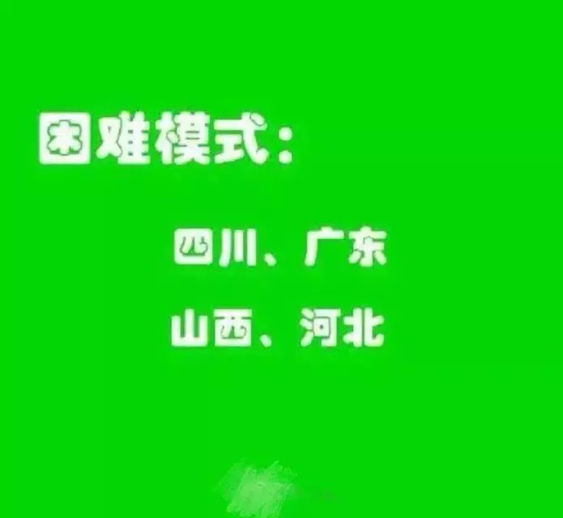
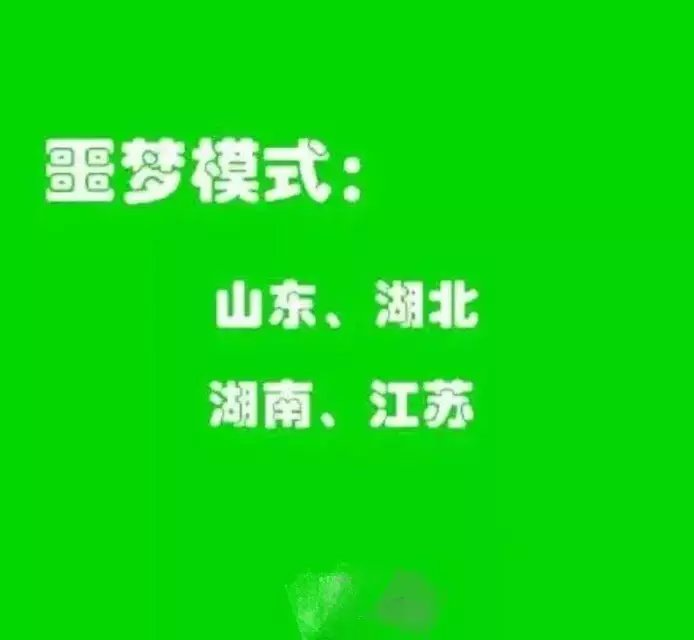

> 评论(2)：

*  [开垦给你](https://user.qzone.qq.com/1468093730)：对安徽深有体会
	* [疯的季节](https://user.qzone.qq.com/1373594376)：[@开垦给你](https://user.qzone.qq.com/1468093730)现在都做全国卷2了
	* [yingshaoxo](https://user.qzone.qq.com/1576570260)：[@疯的季节](https://user.qzone.qq.com/1373594376)有道理。
	* [yingshaoxo](https://user.qzone.qq.com/1576570260)：[@疯的季节](https://user.qzone.qq.com/1373594376)但是教育资源没变，烂的还是烂
*  [离开](https://user.qzone.qq.com/2020514285)：呵呵，加油！

---

> 2015-10-04 12:04:39

为什么要选AI呢？我去年想了整整一个月，发现没有什么事能比它更有意义。

为什么我网名叫英少呢？因为初中看了一部小说，而那部小说没有写完。

> 评论(1)：

*  [Pea](https://user.qzone.qq.com/1055275542)：小说和英少有什么关系
	* [yingshaoxo](https://user.qzone.qq.com/1576570260)：[@Pea](https://user.qzone.qq.com/1055275542)《超级学生》
	* [yingshaoxo](https://user.qzone.qq.com/1576570260)：[@Pea](https://user.qzone.qq.com/1055275542)著者：恋上你的长发

---

> 2015-10-03 02:58:00

家里睡着多好啊，窝心、舒适、暖和。

> 评论(1)：

*  [龚思成](https://user.qzone.qq.com/508614606)：有同感

---

> 2015-10-01 15:38:27

人为何要活？

这个问题世上竟无人能答，然而你们又都活着。

> 评论(1)：

*  [胡亮[表哥](https://user.qzone.qq.com/1929572499)：为了实现理想和追求，为了体现人生自我的价值活着，不是为了活着而活着。人应该有所追求，人应该有个目标。

## 9月

---

> 2015-09-30 19:56:15

[AI独行侠英少  ](http://blog.tianya.cn/blog-5728876-1.shtml)

> 评论(2)：

*  [yingshaoxo](https://user.qzone.qq.com/1576570260)：我的博客，欢迎访问。
*  [yingshaoxo](https://user.qzone.qq.com/1576570260)：http://yingshaoxo.blog.tianya.cn

---

> 2015-09-30 13:24:05

能把我骗上床的方法只有一个

.

.

.

.

.

.

.

.

.

> 评论(3)：

*  [狄诺琪[一起K歌](https://user.qzone.qq.com/374079416)：你居然发这种了。唉。孩子学坏了
	* [yingshaoxo](https://user.qzone.qq.com/1576570260)：[@狄诺琪[一起K歌](https://user.qzone.qq.com/374079416) 额。。。
*  [苏梦](https://user.qzone.qq.com/1724983550)：我查
*  [代大强[初遇学霸](https://user.qzone.qq.com/925846375)：原创？？？
	* [yingshaoxo](https://user.qzone.qq.com/1576570260)：[@代大强[初遇学霸](https://user.qzone.qq.com/925846375) no no 

---

> 2015-09-27 08:37:33

大多数中国人的一生

0—10岁：被迫学习各项课外技能，不断考级，多数是为了父母的面子和期望；

10—20岁：死啃如山的书籍，应付如海的考试；

20—30岁：到处投简历，着急自己找不到工作；

30—40岁：成为房奴、车奴；

40—50岁：为孩子的未来操心，省吃俭用，努力存钱；

50—60岁：终于有了自己的生活，却发现马上要退休，又开始担忧退休后怎么办；

60—70岁：花费大部分精力养生，却发现还要养孙子；

70—80岁：终于安定下来度晚年；

临死前：发现原来一块墓地都贵得要死！

> 评论(0)：

---

> 2015-09-20 21:38:53

我的一轮总策略：

做精不做多，深思戒浮躁。

 ——打死不换，勿劝！

> 评论(0)：

---

> 2015-09-19 14:12:18

我有说过我以后不结婚吗？

还对我存有幻想的小朋友赶快死心吧。

> 评论(0)：

---

> 2015-09-19 12:32:33

你怎么知道你现在不是在做梦？

> 评论(1)：

*  [苟智婷](https://user.qzone.qq.com/1062894483)：因为很痛
	* [yingshaoxo](https://user.qzone.qq.com/1576570260)：[@苟智婷](https://user.qzone.qq.com/1062894483)Me too.

---

> 2015-09-16 12:04:25

疯狂英语＋新概念＋百词斩，天下英语为快不破、唯准不破、唯量不破！

> 评论(1)：

*  [yingshaoxo](https://user.qzone.qq.com/1576570260)：还可以＋美剧，唯纯不破。这里的疯狂英语说的是《疯狂高考》

---

> 2015-09-14 11:05:01

每科每天花2小时学习，坚持三年，一个普通人都能变成高考状元。

因为他每科大约花了10000小时，那是天才的必经之路。

> 评论(2)：

*  [yingshaoxo](https://user.qzone.qq.com/1576570260)：效率的累加，这么浅显的道理我竟会不懂！
*  [yingshaoxo](https://user.qzone.qq.com/1576570260)：听课时间不算，因为效率并没随时间而提高。

---

> 2015-09-12 17:46:34

浮躁、一步登天、不劳而获，都是失败者的专利。

> 评论(1)：

*  [yingshaoxo](https://user.qzone.qq.com/1576570260)：一万小时天才理论。

---

> 2015-09-11 09:02:01

作一次心灵旅行，就以那一本本零落的古卷残页为车票，感受着穿越时空的欣喜。我与李白共攀蜀道，与辛弃疾拍遍栏杆，与柳永同逛青楼，与李清照共度良宵。无论是漠北黄沙，还是江南水乡，我都一一留下足迹。

> 评论(1)：

*  [老夫的少女心♡](https://user.qzone.qq.com/1814843629)：后面两句被徐老师看到，不保证她不打死你

---

> 2015-09-09 22:35:06

班长是个有生活的人。

> 评论(2)：

*  [老夫的少女心♡](https://user.qzone.qq.com/1814843629)：说的苟苟吗？
*  [老夫的少女心♡](https://user.qzone.qq.com/1814843629)：有生活什么意思？
	* [yingshaoxo](https://user.qzone.qq.com/1576570260)：[@老夫的少女心♡](https://user.qzone.qq.com/1814843629)我觉得你是个少生活的人，像个公主，经历得太少。
	* [老夫的少女心♡](https://user.qzone.qq.com/1814843629)：[@yingshaoxo](https://user.qzone.qq.com/1576570260)我生活的很多诶，17年了

---

> 2015-09-05 10:04:57

这个学期的体育课会变得很严酷。

我要用体力倒逼精力。

一辈子的成败就在此一举了。

marathon，I'm coming.

> 评论(0)：

## 8月

---

> 2015-08-30 12:22:48

我只是试着把世界用一个理论连接起来罢了。

> 评论(0)：

---

> 2015-08-29 23:40:04

 学霸养成中 努力工作、懂得休息、少说废话

> 评论(0)：

---

> 2015-08-29 23:37:25

努力工作懂得休息Z：少说废话 —— 出自爱因斯坦

> 评论(0)：

---

> 2015-08-29 22:00:46

A=X+Y+Z！

A：成功

X：努力工作

Y：懂得休息

Z：少说废话

 —— 出自爱因斯坦

> 评论(2)：

*  [yingshaoxo](https://user.qzone.qq.com/1576570260)：虽然不是每个人都能得到举世瞩目的成功，但是却可以做到自己能做的最好。
*  [yingshaoxo](https://user.qzone.qq.com/1576570260)：Because : No pain ! No gain !

---

> 2015-08-27 17:54:50

生命的华丽源于忍的艺术。

> 评论(1)：

*  [yingshaoxo](https://user.qzone.qq.com/1576570260)：I must suffer some things on my own.
	* [c4droid手册作者](https://user.qzone.qq.com/2726844370)：[@yingshaoxo](https://user.qzone.qq.com/1576570260)看懂了 

---

> 2015-08-17 20:07:08

The only constant in the world is change.

 你去和别人比怎么能看到自己的变化？

> 评论(0)：

---

> 2015-08-14 23:54:57

生活告诉我，不要总是抱怨。

只要你相信，希望就是明天。

> 评论(0)：

---

> 2015-08-13 18:38:13

这世上本没有黑幕，不知道的人多了，便成了黑幕。

> 评论(0)：

---

> 2015-08-12 19:21:08

求见爱因斯坦 、图灵 、达尔文、苏格拉底 、拿破仑。

> 评论(4)：

*  [yingshaoxo](https://user.qzone.qq.com/1576570260)：其实还想见希特勒
*  [老夫的少女心♡](https://user.qzone.qq.com/1814843629)：除了希特勒其他的卅
*  [李毅[感谢有你]](https://user.qzone.qq.com/315985447)：为什么想见？
	* [yingshaoxo](https://user.qzone.qq.com/1576570260)：[@李毅[感谢有你]](https://user.qzone.qq.com/315985447)早想见了，没说而已
	* [李毅[感谢有你]](https://user.qzone.qq.com/315985447)：[@yingshaoxo](https://user.qzone.qq.com/1576570260)可惜你见不到。
	* [yingshaoxo](https://user.qzone.qq.com/1576570260)：[@李毅[感谢有你]](https://user.qzone.qq.com/315985447)看错问了，我想和他们交流一下，问一些问题。
	* [李毅[感谢有你]](https://user.qzone.qq.com/315985447)：[@yingshaoxo](https://user.qzone.qq.com/1576570260)人都不在了，怎么交流
	* [yingshaoxo](https://user.qzone.qq.com/1576570260)：[@李毅[感谢有你]](https://user.qzone.qq.com/315985447)hope、wish,you know?
	* [李毅[感谢有你]](https://user.qzone.qq.com/315985447)：[@yingshaoxo](https://user.qzone.qq.com/1576570260)说屁哦。
	* [yingshaoxo](https://user.qzone.qq.com/1576570260)：[@李毅[感谢有你]](https://user.qzone.qq.com/315985447)好像是哦
*  [毛洪渝](https://user.qzone.qq.com/1255847113)：希特勒

---

> 2015-08-09 12:24:49

beyond SB.

> 评论(0)：

---

> 2015-08-06 20:48:20

爱情是一个执着的人与另一个执着的人才有的。

注意是“与”哈，单方面的全不算！

> 评论(0)：

---

> 2015-08-05 22:40:07【转发】

这个怎么做的？

> 原文:

[花开开开](https://user.qzone.qq.com/1241618721)：这个怎么做的？

[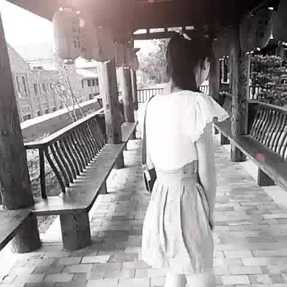](http://vwecam.gtimg.com/1030_d9a18fbe195046dc84a3a8b0764be669.f0.mp4?ptype=http&vkey=9F06BAA19659E7C69E96941D37C1FCE84C084812DDD50AF6D84AA0ACF4C664F164A0ACE555A2162CF25462A29095EC283FE556E43FD374D1&sdtfrom=v1000&owner=0)

> 评论(1)：

*  [棠](https://user.qzone.qq.com/1391122430)：美拍

---

> 2015-08-04 12:17:49

This is my world ! But maybe is not !

> 评论(0)：

---

> 2015-08-02 23:54:22

曾经都有想过，未来过的生活。

时间慢慢走过，有太多的挫折。

经历的太多，困惑也太多，该怎样找到自我。

> 评论(5)：

*  [yingshaoxo](https://user.qzone.qq.com/1576570260)：为什么，我想回去，却发现，再也回不去了。
*  [yingshaoxo](https://user.qzone.qq.com/1576570260)：我们都跟那现实做了朋友，忘记了单纯天真，其实才是你的挚友。
*  [yingshaoxo](https://user.qzone.qq.com/1576570260)：多铭心刻骨，那段走过的路。
*  [再见无期](https://user.qzone.qq.com/2810587486)：别学我 行不行
	* [yingshaoxo](https://user.qzone.qq.com/1576570260)：[@再见无期](https://user.qzone.qq.com/2810587486) 我三年前写的歌词，哪学你了？
	* [再见无期](https://user.qzone.qq.com/2810587486)：[@yingshaoxo](https://user.qzone.qq.com/1576570260)我七年前的思想，你抄袭
	* [再见无期](https://user.qzone.qq.com/2810587486)：[@yingshaoxo](https://user.qzone.qq.com/1576570260)还有，我指的是你自己给自己的评论
	* [yingshaoxo](https://user.qzone.qq.com/1576570260)：[@再见无期](https://user.qzone.qq.com/2810587486) 全是一年前自己写的歌词，你还有什么话想说？
	* [再见无期](https://user.qzone.qq.com/2810587486)：[@yingshaoxo](https://user.qzone.qq.com/1576570260)啧啧，我说你是真的
	* [再见无期](https://user.qzone.qq.com/2810587486)：[@yingshaoxo](https://user.qzone.qq.com/1576570260)以前十二三岁也喜欢写这些
*  [再见无期](https://user.qzone.qq.com/2810587486)：哦，不对。人都这样

## 7月

---

> 2015-07-30 17:48:39

我为我的智商感到着急。

> 评论(2)：

*  [陈友淇[追了三年](https://user.qzone.qq.com/709336882)：我也是
	* [yingshaoxo](https://user.qzone.qq.com/1576570260)：[@陈友淇[追了三年](https://user.qzone.qq.com/709336882)别谦虚
	* [陈友淇[追了三年](https://user.qzone.qq.com/709336882)：[@yingshaoxo](https://user.qzone.qq.com/1576570260) 我的智商肯定是你的好多倍，哦，对了，你不会是负的吧？！
	* [yingshaoxo](https://user.qzone.qq.com/1576570260)：[@陈友淇[追了三年](https://user.qzone.qq.com/709336882)有可能http://www.iqeq.com.cn/upload29/201582847388195.jpg
*  [疯的季节](https://user.qzone.qq.com/1373594376)：用生命一号，提高智力
	* [yingshaoxo](https://user.qzone.qq.com/1576570260)：[@疯的季节](https://user.qzone.qq.com/1373594376)可以考虑

---

> 2015-07-20 21:41:04

这是我的一小步，世界的一大步。

> 评论(1)：

*  [再见无期](https://user.qzone.qq.com/2810587486)：别这么自恋，会英年早逝滴

---

> 2015-07-20 21:39:05

This is my world!

> 评论(0)：

---

> 2015-07-10 21:50:50

这次英语真比语文"好"了，值得庆幸。

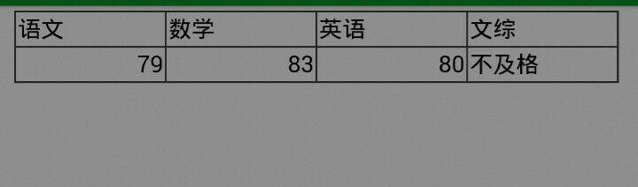

> 评论(3)：

*  [不要过来啊～](https://user.qzone.qq.com/1713106357)：我语文也是79
	* [yingshaoxo](https://user.qzone.qq.com/1576570260)：英语呢？
	* [不要过来啊～](https://user.qzone.qq.com/1713106357)：[@yingshaoxo](https://user.qzone.qq.com/1576570260) 30
	* [yingshaoxo](https://user.qzone.qq.com/1576570260)：[@不要过来啊～](https://user.qzone.qq.com/1713106357)我保持沉默
*  [六天](https://user.qzone.qq.com/837082106)：加油
*  [李毅[感谢有你]](https://user.qzone.qq.com/315985447)：英语能考80了，

---

> 2015-07-08 17:16:05

两耳不闻窗外事，一心只读圣贤书。

> 评论(0)：

---

> 2015-07-06 21:53:20

I decided one way untill to dark —— technology life.

> 评论(0)：

---

> 2015-07-05 18:29:01

几天前我妈说我玩手机，然后我把手机变成砖头，接着去玩书。

几天间体悟出一些道理，分享如下：

1.虽然不太情愿学，但它们毕竟代表人类的智慧。

2.角度不同，对比的主体与对比物不同，就决定了利益立场的不同。

3.以后不要怀疑我的理论，我写的就是对的。

4.只追前一名。

5.没动力吗？你该改变你的利益模式了，去看一看古今中外成功人士的实例吧！接着just do it，待到人之将息时，如果还没成功。就可以说：我今生注定无缘实现我所想。

6.庸人抱怨世界，智者适应世界，勇者改变世界。

7.可信榜样的力量是无穷的。

8.每天起床大喊一声“今天是多崭新美好的一天”！

> 评论(1)：

*  [王希](https://user.qzone.qq.com/1483923283)：6

## 6月

---

> 2015-06-30 21:56:20

什么东西你做得多，你就越感兴趣。

因为你花了时间与精力（将你的利益注入此事）。

当然，付出是有回报的。

> 评论(2)：

*  [李毅[感谢有你]](https://user.qzone.qq.com/315985447)：嗯，付出会有回报的
*  [李毅[感谢有你]](https://user.qzone.qq.com/315985447)：有兴趣的话，做得也多些。

---

> 2015-06-30 12:15:51

对于我这种喜欢装逼，追求与众不同的人来说，环境对我的影响很大。如果大家都认真学习，我就会没动力不学习，如果大家都不喜欢学习，我就会装逼认真学。

> 评论(2)：

*  [李毅[感谢有你]](https://user.qzone.qq.com/315985447)：学习是自己的事，做好自己就好了。
	* [yingshaoxo](https://user.qzone.qq.com/1576570260)：[@李毅[感谢有你]](https://user.qzone.qq.com/315985447)我发现你总能切中要点
*  [yingshaoxo](https://user.qzone.qq.com/1576570260)：。

---

> 2015-06-29 14:26:42

自己搭建的秒赞，觉得自己QQ够安全的可以试试。

[http://yingshaopj.com.cn](http://yingshaopj.com.cn)

> 评论(0)：

---

> 2015-06-28 13:51:16【转发】

不是本人。



请关注欢乐秒赞！

> 原文:

[不想对你说](https://user.qzone.qq.com/148398)：32号第五部视频 请相互转发告知 后续视频请关注空间内容 谢谢

> 评论(1)：

*  [文亮](https://user.qzone.qq.com/435880404)：好！！！！！  Good！

---

> 2015-06-27 13:00:51

不要过于关注社会变化大，只看一点：传媒技术提高了。

> 评论(0)：

---

> 2015-06-25 16:45:05

跳出框框

相信看到这里，你的思维已经有了一个很大的限制框架。

现在，打破它吧！不管它是什么。（它可能是利益限制、习惯限制，更有甚是以毒品或黄色构建出的世界观）

让它在你的脑中扩散、传播。

现在，请你跳出来，感受自由的美妙。

> 评论(0)：

---

> 2015-06-25 15:13:03

我们带着最后一点纯真进入高中，最后在这里湮灭。

> 评论(0)：

---

> 2015-06-24 21:54:19

我深深地感到我的大脑容量已满。

不管我记什么东西，总是要以牺牲另一些已有记忆为代价。

我学数学忘英语，学英语忘语文，学文综忘英数，学编程忘全部。（反过来也一样）

目前尚能处理一些哲学文字工作是因为原先有一定语文基础，除书写外有大量相对稳定的记忆。（可打字）

这给我们一个启示：一定要在儿童、少年时期多开发大脑潜能。（如学双语、哲思、越级数学等）

> 评论(2)：

*  [彭鑫[差强人意](https://user.qzone.qq.com/1057498879)：可能是在你大脑深处已经产生“我已经学的够多了或已经超越某某不必要在学习或学习这些真的很累，我想休息之类的种种因素
	* [yingshaoxo](https://user.qzone.qq.com/1576570260)：[@彭鑫[差强人意](https://user.qzone.qq.com/1057498879)maybe
*  [李毅[感谢有你]](https://user.qzone.qq.com/315985447)：多次重复就会记得更深刻了
	* [yingshaoxo](https://user.qzone.qq.com/1576570260)：[@李毅[感谢有你]](https://user.qzone.qq.com/315985447)You raise me up
	* [yingshaoxo](https://user.qzone.qq.com/1576570260)：其实看到你朴实的文字我很激动
	* [李毅[感谢有你]](https://user.qzone.qq.com/315985447)：[@yingshaoxo](https://user.qzone.qq.com/1576570260)为什么？

---

> 2015-06-23 21:33:16

无考试，无竞争，生活无乐趣。

> 评论(0)：

---

> 2015-06-22 17:17:50

人穷多读书，不要被浮躁世界所迷惑。

> 评论(0)：

---

> 2015-06-19 21:55:21

这是一幅典型的对比认知示意图。

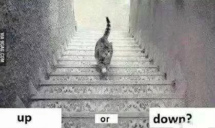

> 评论(3)：

*  [再见无期](https://user.qzone.qq.com/2810587486)：I think it is going walk。。。。哈
*  [六天](https://user.qzone.qq.com/837082106)：挺像地毯
*  [冯杨](https://user.qzone.qq.com/1332497020)：左上右下  做点阴影造成视觉偏差

---

> 2015-06-18 12:36:51

To be,or not to be,that is the question.

> 评论(4)：

*  [刘芳沁](https://user.qzone.qq.com/1357122641)：语病。。
	* [yingshaoxo](https://user.qzone.qq.com/1576570260)：[@刘芳沁](https://user.qzone.qq.com/1357122641)语文书必修五，后面几页，译文。
	* [刘芳沁](https://user.qzone.qq.com/1357122641)：[@yingshaoxo](https://user.qzone.qq.com/1576570260)哦哦
*  [刘芳沁](https://user.qzone.qq.com/1357122641)：that is a question
*  [刘芳沁](https://user.qzone.qq.com/1357122641)：
*  [再见无期](https://user.qzone.qq.com/2810587486)：就是

---

> 2015-06-12 23:13:08

我是一个反权威的极端知识分子！

我是一个失去上进的好色小青年！

我是一个没有潜力的平凡穷小子！

我是一个性格怪异、充满幻想的精神病！

> 评论(7)：

*  [yingshaoxo](https://user.qzone.qq.com/1576570260)：仔细想想，我是不是这种人呢？
*  [yingshaoxo](https://user.qzone.qq.com/1576570260)：是
*  [六天](https://user.qzone.qq.com/837082106)：怎么的呢
	* [yingshaoxo](https://user.qzone.qq.com/1576570260)：[@六天](https://user.qzone.qq.com/837082106)厌世
	* [六天](https://user.qzone.qq.com/837082106)：[@yingshaoxo](https://user.qzone.qq.com/1576570260)过几天可能就好了
	* [yingshaoxo](https://user.qzone.qq.com/1576570260)：[@六天](https://user.qzone.qq.com/837082106)不清楚，这种厌世不是讨厌世界，而是觉得世界在按规律运动，而我又不能脱离或改变什么，只能顺其自然。
	* [六天](https://user.qzone.qq.com/837082106)：[@yingshaoxo](https://user.qzone.qq.com/1576570260)每个人都是这么的，可是我们又不得不这样
*  [邹金汕 ](https://user.qzone.qq.com/657501164)：最近心情不好吗？
	* [yingshaoxo](https://user.qzone.qq.com/1576570260)：[@邹金汕 ](https://user.qzone.qq.com/657501164)算不好吧，我现在失去了奋斗的感觉，每天只是按班就木的做事（在学校）。
	* [邹金汕 ](https://user.qzone.qq.com/657501164)：[@yingshaoxo](https://user.qzone.qq.com/1576570260)深有同感，可是又有什么办法呢？
	* [yingshaoxo](https://user.qzone.qq.com/1576570260)：[@邹金汕 ](https://user.qzone.qq.com/657501164)所以就发发牢骚啦，，然后就看见多年未见的你了，这让我着实感动。
	* [邹金汕 ](https://user.qzone.qq.com/657501164)：[@yingshaoxo](https://user.qzone.qq.com/1576570260)呵呵，确实许久未见了，好好学习，早点睡吧，晚安
*  [刘芳沁](https://user.qzone.qq.com/1357122641)：我们都会这样。坚持坚持会好的。
*  [yingshaoxo](https://user.qzone.qq.com/1576570260)：我坦白:导火线其实是我喜欢一个妹纸，但迫于现实与自己的无能而承受苦楚。习惯就好。
*  [再见无期](https://user.qzone.qq.com/2810587486)：我觉得无论怎样的环境，自己有怎样的情绪，怎样的憧憬，可以发牢骚，可以疯狂，可以沉默，但不可以放弃，不可以不认真、沉着、沉静的对待。无论怎样的想法都可以被抛弃，但勿忘初心

---

> 2015-06-10 22:18:15

晚安，各位！

 [@系统消息](https://user.qzone.qq.com/10000)

> 评论(8)：

*  [Glory.](https://user.qzone.qq.com/1047505798)：我有秒赞就是帅~
*  [Glory.](https://user.qzone.qq.com/1047505798)：我有秒赞就是帅~
*  [Glory.](https://user.qzone.qq.com/1047505798)：我有秒赞就是帅~
*  [Glory.](https://user.qzone.qq.com/1047505798)：我有秒赞就是帅~
*  [Glory.](https://user.qzone.qq.com/1047505798)：我有秒赞就是帅~
*  [Glory.](https://user.qzone.qq.com/1047505798)：我有秒赞就是帅~
*  [Glory.](https://user.qzone.qq.com/1047505798)：我有秒赞就是帅~
*  [Glory.](https://user.qzone.qq.com/1047505798)：我有秒赞就是帅~

## 5月

---

> 2015-05-31 10:31:11

[AI独行侠英少  ](http://yingshaoxo.blog.tianya.cn)

> 评论(2)：

*  [Glory.](https://user.qzone.qq.com/1047505798)：我有秒赞就是帅~
*  [Glory.](https://user.qzone.qq.com/1047505798)：我有秒赞就是帅~

---

> 2015-05-31 09:28:44

我未写完的书，《物质与思想》。

现在公开了，我觉得一个人写没意思。[http://blog.tianya.cn/post-5728876-postId=84257100-1.shtml](http://blog.tianya.cn/post-5728876-postId=84257100-1.shtml)

> 评论(2)：

*  [yingshaoxo](https://user.qzone.qq.com/1576570260)：链接失效了，看日志吧。
*  [Pea](https://user.qzone.qq.com/1055275542)：卧槽，牛逼牛逼

---

> 2015-05-25 18:31:17

你得了你不该得的快乐，你就得还回来。

这就叫天道有偿。

> 评论(1)：

*  [不要过来啊～](https://user.qzone.qq.com/1713106357)：天道

---

> 2015-05-20 11:03:40

我觉得我得了精神衰弱。

另外我失去了考大学的想法。

最后我讨厌日复一日重复的生活。

> 评论(4)：

*  [张翰](https://user.qzone.qq.com/2764241614)：呃呃，不是吧，你这呢想的，你不是成绩不错嘛！
*  [再见无期](https://user.qzone.qq.com/2810587486)：放弃，甘心吗？
	* [yingshaoxo](https://user.qzone.qq.com/1576570260)：[@再见无期](https://user.qzone.qq.com/2810587486)不甘，不过我真的感觉精神衰弱了。
	* [再见无期](https://user.qzone.qq.com/2810587486)：[@yingshaoxo](https://user.qzone.qq.com/1576570260)me too，特别是数学课，反应越来越慢。。
	* [再见无期](https://user.qzone.qq.com/2810587486)：[@yingshaoxo](https://user.qzone.qq.com/1576570260)还有，给你两个字:坚守
*  [胡亮[表哥](https://user.qzone.qq.com/1929572499)：加油。有需要告诉哥哥
	* [yingshaoxo](https://user.qzone.qq.com/1576570260)：[@胡亮[表哥](https://user.qzone.qq.com/1929572499)嗯
*  [yingshaoxo](https://user.qzone.qq.com/1576570260)：搞错了，是神经衰弱。

---

> 2015-05-16 15:41:07【广安市四川省广安中学】

下次说爱你要亲口！

> 评论(4)：

*  [候银[身份证衣服](https://user.qzone.qq.com/644216978)：哟
*  [代大强[初遇学霸](https://user.qzone.qq.com/925846375)：什么情况！
*  [胡志强](https://user.qzone.qq.com/1713428420)：
*  [yingshaoxo](https://user.qzone.qq.com/1576570260)：其实你们都误会了，我也不知道未来这个“她”是哪个，我只是说以后要那么做而已。

---

> 2015-05-03 18:14:17

我不吵了，也不闹了，回到从前好吗？

> 评论(3)：

*  [Gabe](https://user.qzone.qq.com/2317344338)：英少。。怎么了
*  [胡勇](https://user.qzone.qq.com/1264313808)：怎么了？这是对谁说？
	* [yingshaoxo](https://user.qzone.qq.com/1576570260)：[@胡勇](https://user.qzone.qq.com/1264313808)everybody
*  [毛洪渝](https://user.qzone.qq.com/1255847113)：要嗨就要嗨翻全场！要静就要静得深沉！

---

> 2015-05-01 00:57:11

祝广大劳动人民节日快乐！

永远坚信，一份耕耘，一份收获！

为别人服务，最终，也将为自己服务！

> 评论(0)：

## 4月

---

> 2015-04-26 13:15:49

《给小孩》

小孩，小孩，你感到无事可做吗？

为何一生下来就要思考，想了半天无果，也不是真理。

每个人都有他的一套理论，有他的经历。

为什么他们思想不同却一起生活？

大概是爱吧，仁慈的上帝说道。

你错了，他们祖先是单纯的。

他们不看思想，只看结果，对他们是否有利。

他们不知道，但仍在那么做。

他们知道自己需要什么，就像小草喜爱阳光一般。

> 评论(0)：

---

> 2015-04-24 18:18:00

请在生活中保持大脑活跃并积极思考。

这是避免变成白痴的最好办法。

———我差点就**了

> 评论(0)：

---

> 2015-04-19 12:44:39

我亲爱的女士，当年华逝去，又无一技之长，你将如何？

> 评论(1)：

*  [李毅[感谢有你]](https://user.qzone.qq.com/315985447)：光棍

---

> 2015-04-18 22:41:06

极端者自焚

> 评论(0)：

---

> 2015-04-12 20:41:29

只有懦夫才对现实如此害怕。

它诞生了我。

创造出整个世界。

愚昧无知才是害怕的本源。

真的英雄，无惧！

> 评论(1)：

*  [2992905730](https://user.qzone.qq.com/2992905730)：

---

> 2015-04-06 16:31:11

我决定认真学习了。

> 评论(2)：

*  [李毅[感谢有你]](https://user.qzone.qq.com/315985447)：你难道没认真学习吗？
	* [yingshaoxo](https://user.qzone.qq.com/1576570260)：[@李毅[感谢有你]](https://user.qzone.qq.com/315985447)不是，这学期上半期一直很浮躁，没动力。现在除了对文言文反感外，其它的都喜欢。
	* [yingshaoxo](https://user.qzone.qq.com/1576570260)：[@李毅[感谢有你]](https://user.qzone.qq.com/315985447)and li,认真与否差别很大。
	* [初](https://user.qzone.qq.com/839838651)：~快速刅理信~用~卡~:http://t.cn/RA0XBTe 寃壘紾籬
*  [Pea](https://user.qzone.qq.com/1055275542)：大学霸

---

> 2015-04-03 19:51:27

岁月是把杀猪刀，这是我爸。

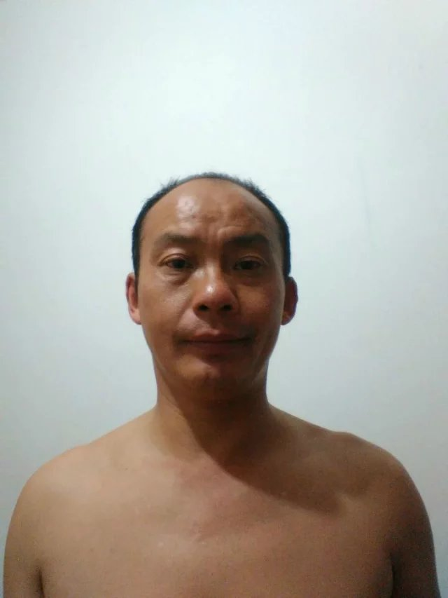

> 评论(5)：

*  [苏梦](https://user.qzone.qq.com/1724983550)：这比喻可不恰当
	* [yingshaoxo](https://user.qzone.qq.com/1576570260)：[@苏梦](https://user.qzone.qq.com/1724983550) 好像是。
*  [Atomy † Vigilante](https://user.qzone.qq.com/946308163)：这位同学，你发完这条说说一定很饿了，来个盖浇饭吧！盖浇饭茄子炒肉盖浇饭 ¥ 13西葫芦炒肉盖浇饭 ¥ 13青椒炒蛋盖浇饭 ¥ 13木耳炒肉盖浇饭 ¥ 14番茄炒蛋盖浇饭 ¥ 13青菜炒肉盖浇饭 ¥ 13土豆牛肉盖浇饭 ¥ 13白菜炒肉盖浇饭 ¥ 13洋葱炒肉盖浇饭 ¥ 13红烧鸡块盖浇饭 ¥ 16葱爆牛肉盖浇饭 ¥ 15葱爆羊肉盖浇饭 ¥ 16红烧牛肉盖浇饭 ¥ 15孜然牛肉盖浇饭 ¥ 15孜然羊肉盖浇饭 ¥ 16红烧牛肉盖浇饭 ¥ 15蒜苔炒肉盖浇饭 ¥ 15蘑菇炒肉盖浇饭 ¥ 14鱼香肉丝盖浇饭 ¥ 14浇头类加煎蛋蛋 ¥ 2葱油饼 ¥ 5加牛肉 ¥ 10加红烧肉 ¥ 12孜然牛肉 ¥ 13红烧鸡块盖浇面 ¥ 16葱爆牛肉盖浇面 ¥ 16葱爆羊肉盖浇面 ¥ 16红烧牛肉盖浇面 ¥ 16蘑菇炒肉盖浇面 ¥ 15蒜苔炒肉盖浇面 ¥ 16番茄炒蛋盖浇面 ¥ 14青椒炒肉盖浇面 ¥ 14土豆牛肉盖浇面 ¥ 16孜然羊肉盖浇面 ¥ 16孜然牛肉盖浇面 ¥ 16
*  [彭鑫[差强人意](https://user.qzone.qq.com/1057498879)：
*  [彭鑫[差强人意](https://user.qzone.qq.com/1057498879)：呵呵
*  [夏红艳](https://user.qzone.qq.com/1284711624)：和你挺像
	* [yingshaoxo](https://user.qzone.qq.com/1576570260)：[@夏红艳](https://user.qzone.qq.com/1284711624)对。

---

> 2015-04-02 22:38:07

看了下，路漫长。

英语要像我的中文水平一样，才有把握。

数学约半本书的公式定理，数千道题型需要把握。

语文没搞头，文综需要记忆大量的逻辑、因果事件。

到时我败了别笑我好吗？

因为我只是个凡人。

> 评论(1)：

*  [老夫的少女心♡](https://user.qzone.qq.com/1814843629)：大家都一样，没什么失败了还取笑的事，不要想太多，加油吧
	* [yingshaoxo](https://user.qzone.qq.com/1576570260)：[@老夫的少女心♡](https://user.qzone.qq.com/1814843629) 真想为你点个赞。
	* [老夫的少女心♡](https://user.qzone.qq.com/1814843629)：[@yingshaoxo](https://user.qzone.qq.com/1576570260)嗯，点嘛

---

> 2015-04-01 18:39:17

我宣布，我以后只修法律。

在道德上随便。

别在我面前打扮得很漂亮，我会看着你。

别在我面前曝光，我会盯着你。

至于原因嘛，传统道德让我很难受。

我之认为，从小到大，妈妈一看到某些画面，如男女亲吻等，就叫我不要看。

诸如此类规范深深的印在我的脑海，这都导致了我对女性的自闭心理，与我的正常需求相违背。

这是不利于我发展的。所以为了更好的生活，束缚要打破。

> 评论(1)：

*  [胡志强](https://user.qzone.qq.com/1713428420)：太长了，秒赞

---

> 2015-04-01 00:27:32

还是在想，中国30年破30亿人口的事。

那竞争得多残酷。人均生产值得多低。

又或者男女比例不均加剧。

这些想都不敢想，一想就觉得前途一片黑暗。

你说为什么结婚就必须生孩子，中国人固有思维。

能不能套用一句话？越生越穷。

人们又不是没学过生物，到时候的进化过程可就惨不忍睹了。

> 评论(2)：

*  [yingshaoxo](https://user.qzone.qq.com/1576570260)：嘿嘿，中国的合理人口容量才7亿。
*  [老夫的少女心♡](https://user.qzone.qq.com/1814843629)：所以大家少生或者不要生了卅

---

> 2015-04-01 00:05:09

付不起责任，才高冷。

You know I meaning?

Now,I'm a poor man.

Maybe it will continued.

Because desire endless.

Money can't take away at birth or death.

> 评论(0)：

## 3月

---

> 2015-03-29 12:13:47

我宣布以后星期天下午不接待任何人。

I want to quiet for a while.

> 评论(0)：

---

> 2015-03-28 14:20:58

发表图片

> 评论(4)：

*  [渝怀](https://user.qzone.qq.com/3030144331)：我好想你
*  [彭鑫[差强人意](https://user.qzone.qq.com/1057498879)：想那个
	* [yingshaoxo](https://user.qzone.qq.com/1576570260)：[@彭鑫[差强人意](https://user.qzone.qq.com/1057498879)a woman.
*  [彭鑫[差强人意](https://user.qzone.qq.com/1057498879)：
*  [李毅[感谢有你]](https://user.qzone.qq.com/315985447)：l  miss you

---

> 2015-03-22 14:20:42

没错，是这样的，社会整体道德在下降。

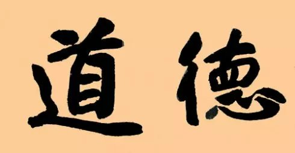

> 评论(0)：

---

> 2015-03-14 12:56:50

对小朋友说现在中国没有阶级，我觉得你在坑他。

换句话说，现在没有阶级剥削，我觉得你在坑我。

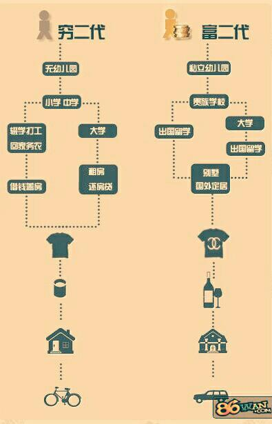

> 评论(3)：

*  [黒客傳說](https://user.qzone.qq.com/1720751880)：如果没有差距  这还可以叫社会吗？
	* [yingshaoxo](https://user.qzone.qq.com/1576570260)：[@黒客傳說](https://user.qzone.qq.com/1720751880)嗯
	* [黒客傳說](https://user.qzone.qq.com/1720751880)：[@yingshaoxo](https://user.qzone.qq.com/1576570260)英少  dkd 在找你
	* [黒客傳說](https://user.qzone.qq.com/1720751880)：[@yingshaoxo](https://user.qzone.qq.com/1576570260)快去回复他
	* [yingshaoxo](https://user.qzone.qq.com/1576570260)：[@黒客傳說](https://user.qzone.qq.com/1720751880)没有哦。
*  [苏梦](https://user.qzone.qq.com/1724983550)：肯定有的！！比如平等也只是相对的 不是绝对的！思考一下如果没有阶级了社会会进步？
	* [yingshaoxo](https://user.qzone.qq.com/1576570260)：[@苏梦](https://user.qzone.qq.com/1724983550)嗯，相对
	* [苏梦](https://user.qzone.qq.com/1724983550)：[@yingshaoxo](https://user.qzone.qq.com/1576570260)对的
*  [苏梦](https://user.qzone.qq.com/1724983550)：大同社会又该是怎样的？
	* [yingshaoxo](https://user.qzone.qq.com/1576570260)：[@苏梦](https://user.qzone.qq.com/1724983550)永不存在。

---

> 2015-03-01 14:41:20

学校比外面让我安心多了。

> 评论(0)：

## 2月

---

> 2015-02-27 22:26:11

存在感很重要吗？为什么连我都像是在刷存在感。

> 评论(2)：

*  [彭鑫[差强人意](https://user.qzone.qq.com/1057498879)：每一个人的存在都是渺小的
	* [炫酷小巴](https://user.qzone.qq.com/2489846365)：~快速刅理信~用~卡~:http://t.cn/RwHUwj8 瞞娤
	* [哦](https://user.qzone.qq.com/1362649161)：~快速刅理信~用~卡~:http://t.cn/Rw21gr7 聈蒁掬濕蘢
*  [yingshaoxo](https://user.qzone.qq.com/1576570260)：人多吧。

---

> 2015-02-25 16:19:20

所谓真诚大方，说白了就是利益明说。

> 评论(2)：

*  [李毅[感谢有你]](https://user.qzone.qq.com/315985447)：现实如此。
	* [yingshaoxo](https://user.qzone.qq.com/1576570260)：[@李毅[感谢有你]](https://user.qzone.qq.com/315985447) 我妈说这样死得快。
*  [张翰](https://user.qzone.qq.com/2764241614)：。。。。

---

> 2015-02-24 19:33:17

刚才和亲戚朋友吃饭，吃着吃着我哭了。因为我说了些不该说的话。

于是我想让你们看看，这些话是什么。

> 评论(4)：

*  [刘芳沁](https://user.qzone.qq.com/1357122641)：不得哦？说你不想回家？
	* [yingshaoxo](https://user.qzone.qq.com/1576570260)：[@刘芳沁](https://user.qzone.qq.com/1357122641) 我几年没和亲戚朋友说一句话，一开口，可想而知。。。
	* [刘芳沁](https://user.qzone.qq.com/1357122641)：[@yingshaoxo](https://user.qzone.qq.com/1576570260)真的哇！那应该好好沟通一下的！
*  [映人](https://user.qzone.qq.com/893798381)：啥子话？？！！
	* [yingshaoxo](https://user.qzone.qq.com/1576570260)：[@映人](https://user.qzone.qq.com/893798381) 一言难尽
	* [映人](https://user.qzone.qq.com/893798381)：[@yingshaoxo](https://user.qzone.qq.com/1576570260)说来听听
*  [杨薄](https://user.qzone.qq.com/384933434)：
*  [苟智婷](https://user.qzone.qq.com/1062894483)：

---

> 2015-02-24 19:19:05

我甚至于对我到底能做什么产生了怀疑。

> 评论(1)：

*  [杨薄](https://user.qzone.qq.com/384933434)：正常

---

> 2015-02-23 11:22:13

孤独患者、忧郁症者、悲观主义者，记住一句话：遇事做最坏打算，还需思考最坏结果中好的一面。

> 评论(1)：

*  [彭鑫[差强人意](https://user.qzone.qq.com/1057498879)：最坏的结果有可能对以后的遇事更有利
	* [yingshaoxo](https://user.qzone.qq.com/1576570260)：[@彭鑫[差强人意](https://user.qzone.qq.com/1057498879)yeah.
	* [彭鑫[差强人意](https://user.qzone.qq.com/1057498879)：[@yingshaoxo](https://user.qzone.qq.com/1576570260)what

---

> 2015-02-23 02:06:50

我想我，以后的座右铭是:

勿要浮躁，专心致志。

脚踏实地，细致入微。

勤俭朴素，真诚大方。

> 评论(3)：

*  [苟智婷](https://user.qzone.qq.com/1062894483)：我感觉你距离这好远
	* [yingshaoxo](https://user.qzone.qq.com/1576570260)：[@苟智婷](https://user.qzone.qq.com/1062894483)嗯
	* [yingshaoxo](https://user.qzone.qq.com/1576570260)：[@yingshaoxo](https://user.qzone.qq.com/1576570260)这里的真诚不是你想的那样，它是一条不归路，想什么说什么，口无遮拦。至于大方，就是不管对方如何对我，我都平静置之。
*  [Ting](https://user.qzone.qq.com/1728017028)：英，挺你！
*  [杨薄](https://user.qzone.qq.com/384933434)：

---

> 2015-02-21 19:25:18

怪政府搞的这套道德教育，从小耳濡目染高尚情操。

我已经学不会阿谀奉承了。

我已经学不会阴险狡诈了。

总感觉有点违心。

只能等待，要不灭亡，要不沉沦。

> 评论(1)：

*  [小雅](https://user.qzone.qq.com/296209157)：...

---

> 2015-02-21 16:39:37

今年过的最差年，什么感觉都没有。

想放擦炮都没人卖！


> 评论(2)：

*  [初见于心　　　　　　](https://user.qzone.qq.com/1336832246)：多和家人聊聊天吧，别老玩我们。by手机和电视
*  [小雅](https://user.qzone.qq.com/296209157)：...

---

> 2015-02-19 00:32:03

今夜无眠。

> 评论(0)：

---

> 2015-02-18 11:45:55

Let go of the past and start off new.

> 评论(0)：

---

> 2015-02-16 19:24:47

我是一个浮躁的人。

> 评论(5)：

*  [yingshaoxo](https://user.qzone.qq.com/1576570260)：凡成事者，要心存高远，更要脚踏实地。
*  [yingshaoxo](https://user.qzone.qq.com/1576570260)：现在浮躁之风分为三类：对现有目标的专注度不够，对现有目标的耐心度不足以及现有的目标不切实际．
*  [yingshaoxo](https://user.qzone.qq.com/1576570260)：“浮躁”指轻浮，做事无恒心，见异思迁，不安分守己，总想投机取巧，成天无所事事，脾气大。
*  [yingshaoxo](https://user.qzone.qq.com/1576570260)：如果我们能安下心来认真做一件事情，就没有做不好的。
*  [yingshaoxo](https://user.qzone.qq.com/1576570260)：以上取自百度百科。

---

> 2015-02-14 00:07:23

我想到一个比较疯狂的学习方法。

对于有钱的土豪先生很有用。

我们从小到大都是规规矩矩的读书。

但有时候你会不会有一种冲动，一种想把书撕了的冲动！

很多时候，我们并不是对某些知识很感兴趣，只是迫于考试，要了解它而已。

市面上那么多教辅资料，要想老老实实看完我估计是不可能的。

那么我们大可买些知识点全的书籍，一有空，便发泄自己的私欲，撕那么一张下来看。

一时看不完揣兜里，有空接着看，看完就扔掉。(当然，你也可以选择记住后再扔)

等把整本书撕完后，觉得这本书还不错，就再去买一本，重新学一遍。(这时书又是新版了)

这样做，可以防止你买书不看，或者不看完。毕竟花了钱的，撕下来不看几眼我估计你睡不着。(我就买了三本理科的书，寒假到现在还没去看，这不是浪费钱吗？果断发泄吧。三年一晃就过了，我也不在乎那几十元钱。钱又买不回青春。)

> 评论(3)：

*  [初见于心　　　　　　](https://user.qzone.qq.com/1336832246)：亲，每天都要快快乐乐哇  ----陌小潇
*  [yingshaoxo](https://user.qzone.qq.com/1576570260)：[@小雅](https://user.qzone.qq.com/296209157)我一本书起码500页，买成50，一页一分钱都挂不上，我为何要心痛？
*  [yingshaoxo](https://user.qzone.qq.com/1576570260)：[@小雅](https://user.qzone.qq.com/296209157)老实说吧，你一辈子没撕过书，是不？

---

> 2015-02-11 21:49:34

我在想我的言论会不会引火烧身。

> 评论(2)：

*  [或许未来](https://user.qzone.qq.com/2109834263)：你太看得起自己了
	* [yingshaoxo](https://user.qzone.qq.com/1576570260)：[@或许未来](https://user.qzone.qq.com/2109834263)十有八九你的身份我已知晓。
*  [或许未来](https://user.qzone.qq.com/2109834263)：so what?
	* [yingshaoxo](https://user.qzone.qq.com/1576570260)：[@或许未来](https://user.qzone.qq.com/2109834263)你会不会在我后面点把火？
	* [或许未来](https://user.qzone.qq.com/2109834263)：[@yingshaoxo](https://user.qzone.qq.com/1576570260)无聊
	* [yingshaoxo](https://user.qzone.qq.com/1576570260)：[@或许未来](https://user.qzone.qq.com/2109834263)我更确定你是谁了。
	* [或许未来](https://user.qzone.qq.com/2109834263)：[@yingshaoxo](https://user.qzone.qq.com/1576570260)所以呢，知道就知道啊，郁闷
	* [yingshaoxo](https://user.qzone.qq.com/1576570260)：[@或许未来](https://user.qzone.qq.com/2109834263)所以要把你加黑啊！
	* [或许未来](https://user.qzone.qq.com/2109834263)：[@yingshaoxo](https://user.qzone.qq.com/1576570260)随你便，我只是为达目标不择手段而已
	* [yingshaoxo](https://user.qzone.qq.com/1576570260)：[@或许未来](https://user.qzone.qq.com/2109834263)你总算承认了。你会点火。

---

> 2015-02-02 16:49:09

思想就像病毒，病毒会传染。

太多思想一起涌来，头部就像要撕裂般，难受。

简单点、明了点，想想也只有小学语文书了。

> 评论(2)：

*  [或许未来](https://user.qzone.qq.com/2109834263)：呃。。。不至于吧。就六科而已，初中九科也没把你逼死啊
	* [yingshaoxo](https://user.qzone.qq.com/1576570260)：[@或许未来](https://user.qzone.qq.com/2109834263)原来你是我的初中同学。
	* [或许未来](https://user.qzone.qq.com/2109834263)：[@yingshaoxo](https://user.qzone.qq.com/1576570260)不是，难道你初中不是学九科
	* [或许未来](https://user.qzone.qq.com/2109834263)：[@yingshaoxo](https://user.qzone.qq.com/1576570260)为何装蒜？
*  [张玲](https://user.qzone.qq.com/2540092680)：请问我是谁
	* [yingshaoxo](https://user.qzone.qq.com/1576570260)：[@张玲](https://user.qzone.qq.com/2540092680) 你说呢？
	* [张玲](https://user.qzone.qq.com/2540092680)：[@yingshaoxo](https://user.qzone.qq.com/1576570260)我就是不知道，问你哦

## 1月

---

> 2015-01-30 19:03:29

面对网络的迅速发展，我们只有两个选择：1.当成现实2.当成虚拟。

那么你是否纠结呢？

> 评论(5)：

*  [夏心诚[爱好音乐](https://user.qzone.qq.com/1437737966)：1
	* [yingshaoxo](https://user.qzone.qq.com/1576570260)：那你在网上交的朋友就可以任意伤害，随意欺骗了吗？
	* [夏心诚[爱好音乐](https://user.qzone.qq.com/1437737966)：[@yingshaoxo](https://user.qzone.qq.com/1576570260)网络固然是虚幻的，但网络的发展是无法阻止的，网上的朋友，同样也是朋友，用真心才能换来实意，可网络毕竟是虚幻化的东西，什么事都要长一个心眼，不然吃亏的也许就是自己，欺骗  有时候是为了维持关系，不一定就是坏的，不过欺骗始终是欺骗了，只能自我克制，毕竟   这是人之常情，但又仔细想想，如果世界少了谎言，那么真诚又拿来干什么呢？
	* [yingshaoxo](https://user.qzone.qq.com/1576570260)：[@夏心诚[爱好音乐](https://user.qzone.qq.com/1437737966)吾尝终日而思矣，不如须臾之所学也；吾尝跂而望矣，不如上网之博见也。上网而学，臂非加长也，而见者远；随口而说，声非加疾也，而闻者彰。假舆马者，非利足也，而致千里；假舟楫者，非能水也，而绝江河。君子生活非异也，善假于网也。说明网络只是把你的口耳眼等感觉范围扩大了，你还是在做交际，只不过范围扩大了而已。你有何高见？
	* [夏心诚[爱好音乐](https://user.qzone.qq.com/1437737966)：[@夏心诚[爱好音乐](https://user.qzone.qq.com/1437737966)大众传媒有好也有坏，但就目前来看利大于弊，至于有何好处请看政治与文化
	* [yingshaoxo](https://user.qzone.qq.com/1576570260)：[@夏心诚[爱好音乐](https://user.qzone.qq.com/1437737966)说得好……
*  [𝐕𝐢𝐧𝐤𝐨𝐚𝐭𝐡](https://user.qzone.qq.com/528705523)：2
	* [yingshaoxo](https://user.qzone.qq.com/1576570260)：那你在网上与那些现实中的朋友之间的情谊都是虚假的了……
	* [yingshaoxo](https://user.qzone.qq.com/1576570260)：那在网上你与那些现实中朋友的感情就是虚假的了？
	* [𝐕𝐢𝐧𝐤𝐨𝐚𝐭𝐡](https://user.qzone.qq.com/528705523)：[@yingshaoxo](https://user.qzone.qq.com/1576570260) 不是 游戏方面
*  [YH](https://user.qzone.qq.com/1244602408)：1。 否则被淘汰
*  [yingshaoxo](https://user.qzone.qq.com/1576570260)：这是一个不好回答的问题，也是一个必须回答的问题。
*  [或许未来](https://user.qzone.qq.com/2109834263)：绝对2

---

> 2015-01-27 15:13:01

英语、数学，两大硬骨头，大家一起努力吧！

Remember,you can make it.

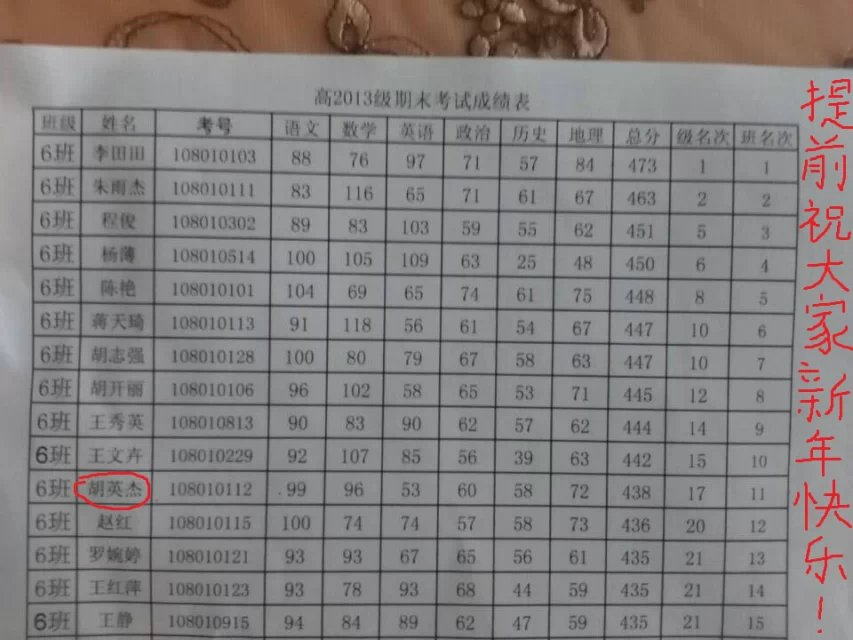

> 评论(2)：

*  [杜学梅](https://user.qzone.qq.com/1769775995)：加油！
*  [何书婷](https://user.qzone.qq.com/1621992657)：这是真的？
	* [yingshaoxo](https://user.qzone.qq.com/1576570260)：[@何书婷](https://user.qzone.qq.com/1621992657)Yeah,that&#039;s real.
	* [何书婷](https://user.qzone.qq.com/1621992657)：[@yingshaoxo](https://user.qzone.qq.com/1576570260)蒽蒽

---

> 2015-01-26 13:41:43

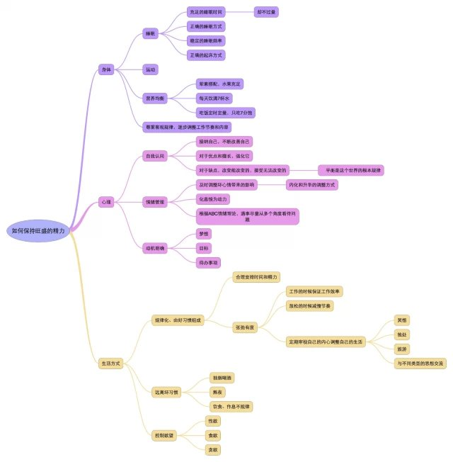

> 评论(1)：

*  [黒客傳說](https://user.qzone.qq.com/1720751880)：这只是你自身的一方面而已  你很多方面需要思考的

---

> 2015-01-25 18:41:49

Fresh air is fundamental to good health.

> 评论(4)：

*  [春栀子](https://user.qzone.qq.com/953413215)：
*  [YH](https://user.qzone.qq.com/1244602408)：But almost can not see
	* [yingshaoxo](https://user.qzone.qq.com/1576570260)：[@YH](https://user.qzone.qq.com/1244602408) of course。
*  [YH](https://user.qzone.qq.com/1244602408)：Give up.You can not change it.Guy.
	* [yingshaoxo](https://user.qzone.qq.com/1576570260)：[@YH](https://user.qzone.qq.com/1244602408) I never give up。
*  [YH](https://user.qzone.qq.com/1244602408)：如果有错误轻喷

---

> 2015-01-11 12:02:45

这是一项长期付出工程，每天花少量的精力，到一定时候，我得到的就是永久记忆、超强口才、绝对毅力。

> 评论(1)：

*  [℡逗比看过来゛](https://user.qzone.qq.com/1643315824)：你在做什么
	* [yingshaoxo](https://user.qzone.qq.com/1576570260)：读书
	* [℡逗比看过来゛](https://user.qzone.qq.com/1643315824)：[@yingshaoxo](https://user.qzone.qq.com/1576570260)在哪里读
	* [yingshaoxo](https://user.qzone.qq.com/1576570260)：[@℡逗比看过来゛](https://user.qzone.qq.com/1643315824)si yuan
	* [℡逗比看过来゛](https://user.qzone.qq.com/1643315824)：[@yingshaoxo](https://user.qzone.qq.com/1576570260)我在广安
	* [℡逗比看过来゛](https://user.qzone.qq.com/1643315824)：[@yingshaoxo](https://user.qzone.qq.com/1576570260)我们隔得应该不远
	* [yingshaoxo](https://user.qzone.qq.com/1576570260)：[@℡逗比看过来゛](https://user.qzone.qq.com/1643315824)嗯

